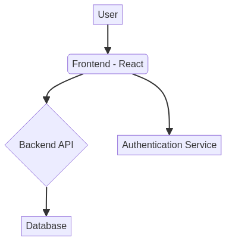
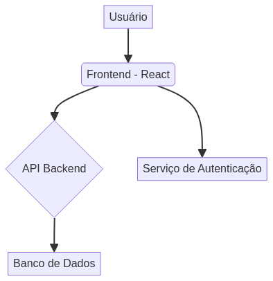

# React Social Network

[](https://github.com/galafis/React-Social-Network/blob/master/LICENSE)
[](https://react.dev/)
[](https://www.npmjs.com/)

## English

### 🚀 Overview

This project is a professional social networking application built with React, designed to showcase modern web development practices and interactive user interfaces. It provides a platform for users to connect, share content, and interact in a dynamic environment.

### ✨ Features

*   User authentication and authorization
*   Profile management
*   Post creation and interaction (likes, comments)
*   Real-time notifications
*   Responsive design for various devices

### 🛠️ Technologies Used

*   **Frontend:** React, JavaScript, HTML, CSS
*   **Package Manager:** npm

### 🏁 Quick Start

To get a local copy up and running, follow these simple steps.

#### Prerequisites

Ensure you have npm installed.

```bash
npm install npm@latest -g
```

#### Installation

1.  Clone the repo
    ```bash
    git clone https://github.com/galafis/React-Social-Network.git
    ```
2.  Navigate to the project directory
    ```bash
    cd React-Social-Network
    ```
3.  Install NPM packages
    ```bash
    npm install
    ```
4.  Start the development server
    ```bash
    npm start
    ```

### 🖼️ Hero Image


### 📊 Architecture Diagram



### 🛡️ License

Distributed under the MIT License. See `LICENSE` for more information.

### 👤 Author

**Gabriel Demetrios Lafis**

*   [GitHub](https://github.com/galafis)
*   [LinkedIn](https://www.linkedin.com/in/gabriel-demetrios-lafis)

---

## Português

[](https://github.com/galafis/React-Social-Network/blob/master/LICENSE)
[](https://react.dev/)
[](https://www.npmjs.com/)

### 🚀 Visão Geral

Este projeto é uma aplicação profissional de rede social construída com React, projetada para demonstrar práticas modernas de desenvolvimento web e interfaces de usuário interativas. Ele oferece uma plataforma para os usuários se conectarem, compartilharem conteúdo e interagirem em um ambiente dinâmico.

### ✨ Funcionalidades

*   Autenticação e autorização de usuários
*   Gerenciamento de perfil
*   Criação e interação com posts (curtidas, comentários)
*   Notificações em tempo real
*   Design responsivo para diversos dispositivos

### 🛠️ Tecnologias Utilizadas

*   **Frontend:** React, JavaScript, HTML, CSS
*   **Gerenciador de Pacotes:** npm

### 🏁 Início Rápido

Para ter uma cópia local funcionando, siga estes passos simples.

#### Pré-requisitos

Certifique-se de ter o npm instalado.

```bash
npm install npm@latest -g
```

#### Instalação

1.  Clone o repositório
    ```bash
    git clone https://github.com/galafis/React-Social-Network.git
    ```
2.  Navegue até o diretório do projeto
    ```bash
    cd React-Social-Network
    ```
3.  Instale os pacotes NPM
    ```bash
    npm install
    ```
4.  Inicie o servidor de desenvolvimento
    ```bash
    npm start
    ```

### 🖼️ Imagem Hero


### 📊 Diagrama de Arquitetura



### 🛡️ Licença

Distribuído sob a Licença MIT. Veja `LICENSE` para mais informações.

### 👤 Autor

**Gabriel Demetrios Lafis**

*   [GitHub](https://github.com/galafis)
*   [LinkedIn](https://www.linkedin.com/in/gabriel-demetrios-lafis)

